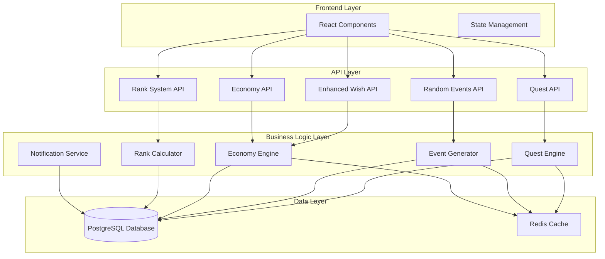

# Design Document: Quest Economy System

## Overview

Данный документ описывает архитектуру и дизайн расширенной квестовой системы с экономикой желаний. Система заменит текущую простую трехуровневую систему на полноценную экономику с квестами, случайными событиями, общими желаниями, подарками и военными рангами.

Основные принципы дизайна:
- **Масштабируемость**: архитектура должна легко расширяться новыми типами активностей
- **Производительность**: оптимизация для быстрых операций чтения/записи
- **Целостность данных**: строгие ограничения и валидация
- **Пользовательский опыт**: интуитивный интерфейс с мгновенной обратной связью

## Architecture

### High-Level Architecture



### Database Schema Evolution

Расширение текущей схемы базы данных для поддержки новой функциональности:

```sql
-- Расширение таблицы users для рангов и экономики
ALTER TABLE users ADD COLUMN IF NOT EXISTS rank VARCHAR(50) DEFAULT 'Рядовой';
ALTER TABLE users ADD COLUMN IF NOT EXISTS experience_points INTEGER DEFAULT 0;
ALTER TABLE users ADD COLUMN IF NOT EXISTS daily_quota_used INTEGER DEFAULT 0;
ALTER TABLE users ADD COLUMN IF NOT EXISTS weekly_quota_used INTEGER DEFAULT 0;
ALTER TABLE users ADD COLUMN IF NOT EXISTS monthly_quota_used INTEGER DEFAULT 0;
ALTER TABLE users ADD COLUMN IF NOT EXISTS last_quota_reset DATE DEFAULT CURRENT_DATE;

-- Новая таблица квестов
CREATE TABLE quests (
    id UUID PRIMARY KEY DEFAULT gen_random_uuid(),
    title VARCHAR(200) NOT NULL,
    description TEXT NOT NULL,
    author_id UUID REFERENCES users(id) ON DELETE CASCADE,
    assignee_id UUID REFERENCES users(id) ON DELETE CASCADE,
    category VARCHAR(50) NOT NULL,
    difficulty VARCHAR(20) NOT NULL CHECK (difficulty IN ('easy', 'medium', 'hard', 'epic')),
    reward_type VARCHAR(20) NOT NULL,
    reward_amount INTEGER NOT NULL,
    experience_reward INTEGER DEFAULT 0,
    status VARCHAR(20) DEFAULT 'active' CHECK (status IN ('active', 'completed', 'expired', 'cancelled')),
    due_date TIMESTAMP,
    created_at TIMESTAMP DEFAULT NOW(),
    completed_at TIMESTAMP,
    metadata JSONB DEFAULT '{}'
);

-- Таблица случайных событий
CREATE TABLE random_events (
    id UUID PRIMARY KEY DEFAULT gen_random_uuid(),
    user_id UUID REFERENCES users(id) ON DELETE CASCADE,
    title VARCHAR(200) NOT NULL,
    description TEXT NOT NULL,
    reward_type VARCHAR(20) NOT NULL,
    reward_amount INTEGER NOT NULL,
    experience_reward INTEGER DEFAULT 0,
    status VARCHAR(20) DEFAULT 'active' CHECK (status IN ('active', 'completed', 'expired')),
    expires_at TIMESTAMP NOT NULL,
    created_at TIMESTAMP DEFAULT NOW(),
    completed_at TIMESTAMP,
    completed_by UUID REFERENCES users(id),
    metadata JSONB DEFAULT '{}'
);

-- Расширение таблицы wishes
ALTER TABLE wishes ADD COLUMN IF NOT EXISTS category VARCHAR(50) DEFAULT 'general';
ALTER TABLE wishes ADD COLUMN IF NOT EXISTS is_shared BOOLEAN DEFAULT FALSE;
ALTER TABLE wishes ADD COLUMN IF NOT EXISTS is_gift BOOLEAN DEFAULT FALSE;
ALTER TABLE wishes ADD COLUMN IF NOT EXISTS is_historical BOOLEAN DEFAULT FALSE;
ALTER TABLE wishes ADD COLUMN IF NOT EXISTS shared_approved_by UUID REFERENCES users(id);
ALTER TABLE wishes ADD COLUMN IF NOT EXISTS priority INTEGER DEFAULT 1;

-- Таблица категорий желаний
CREATE TABLE wish_categories (
    id UUID PRIMARY KEY DEFAULT gen_random_uuid(),
    name VARCHAR(100) NOT NULL UNIQUE,
    emoji VARCHAR(10),
    color VARCHAR(20),
    created_at TIMESTAMP DEFAULT NOW()
);

-- Таблица рангов
CREATE TABLE ranks (
    id UUID PRIMARY KEY DEFAULT gen_random_uuid(),
    name VARCHAR(100) NOT NULL UNIQUE,
    min_experience INTEGER NOT NULL,
    daily_quota_bonus INTEGER DEFAULT 0,
    weekly_quota_bonus INTEGER DEFAULT 0,
    monthly_quota_bonus INTEGER DEFAULT 0,
    special_privileges JSONB DEFAULT '{}',
    emoji VARCHAR(10),
    created_at TIMESTAMP DEFAULT NOW()
);

-- Таблица экономических настроек
CREATE TABLE economy_settings (
    id UUID PRIMARY KEY DEFAULT gen_random_uuid(),
    setting_key VARCHAR(100) NOT NULL UNIQUE,
    setting_value JSONB NOT NULL,
    description TEXT,
    updated_at TIMESTAMP DEFAULT NOW()
);

-- Расширение таблицы транзакций
ALTER TABLE transactions ADD COLUMN IF NOT EXISTS transaction_category VARCHAR(50) DEFAULT 'manual';
ALTER TABLE transactions ADD COLUMN IF NOT EXISTS experience_gained INTEGER DEFAULT 0;
```

## Components and Interfaces

### Core Interfaces

```typescript
// Расширенные интерфейсы
interface EnhancedUser extends User {
  rank: string;
  experience_points: number;
  daily_quota_used: number;
  weekly_quota_used: number;
  monthly_quota_used: number;
  last_quota_reset: Date;
}

interface Quest {
  id: string;
  title: string;
  description: string;
  author_id: string;
  assignee_id: string;
  category: string;
  difficulty: 'easy' | 'medium' | 'hard' | 'epic';
  reward_type: string;
  reward_amount: number;
  experience_reward: number;
  status: 'active' | 'completed' | 'expired' | 'cancelled';
  due_date?: Date;
  created_at: Date;
  completed_at?: Date;
  metadata: Record<string, any>;
}

interface RandomEvent {
  id: string;
  user_id: string;
  title: string;
  description: string;
  reward_type: string;
  reward_amount: number;
  experience_reward: number;
  status: 'active' | 'completed' | 'expired';
  expires_at: Date;
  created_at: Date;
  completed_at?: Date;
  completed_by?: string;
  metadata: Record<string, any>;
}

interface EnhancedWish extends Wish {
  category: string;
  is_shared: boolean;
  is_gift: boolean;
  is_historical: boolean;
  shared_approved_by?: string;
  priority: number;
}

interface WishCategory {
  id: string;
  name: string;
  emoji?: string;
  color?: string;
  created_at: Date;
}

interface Rank {
  id: string;
  name: string;
  min_experience: number;
  daily_quota_bonus: number;
  weekly_quota_bonus: number;
  monthly_quota_bonus: number;
  special_privileges: Record<string, any>;
  emoji?: string;
  created_at: Date;
}

interface EconomyQuotas {
  daily: {
    limit: number;
    used: number;
    reset_time: Date;
  };
  weekly: {
    limit: number;
    used: number;
    reset_time: Date;
  };
  monthly: {
    limit: number;
    used: number;
    reset_time: Date;
  };
}
```

### API Endpoints Design

```typescript
// Quest API
POST   /api/quests                    // Создать квест
GET    /api/quests                    // Получить квесты (с фильтрами)
GET    /api/quests/:id                // Получить конкретный квест
PUT    /api/quests/:id                // Обновить квест
DELETE /api/quests/:id                // Удалить квест
POST   /api/quests/:id/complete       // Засчитать выполнение квеста
POST   /api/quests/:id/cancel         // Отменить квест

// Random Events API
GET    /api/events/current            // Получить текущее событие пользователя
POST   /api/events/:id/complete       // Засчитать выполнение события
POST   /api/events/generate           // Сгенерировать новое событие (система)

// Enhanced Wishes API
GET    /api/wishes/my                 // Мои созданные желания
GET    /api/wishes/assigned           // Желания назначенные мне
GET    /api/wishes/shared             // Общие желания
POST   /api/wishes/shared             // Создать общее желание
PUT    /api/wishes/shared/:id/approve // Подтвердить общее желание
POST   /api/wishes/gift               // Подарить желание
GET    /api/wishes/categories         // Получить категории

// Economy API
GET    /api/economy/quotas            // Получить текущие квоты
POST   /api/economy/gift              // Подарить желание (с проверкой квот)
GET    /api/economy/settings          // Получить настройки экономики
POST   /api/economy/exchange          // Обменять желания (расширенный)

// Rank System API
GET    /api/ranks                     // Получить все ранги
GET    /api/ranks/current             // Получить текущий ранг пользователя
GET    /api/ranks/progress            // Получить прогресс к следующему рангу
POST   /api/ranks/calculate           // Пересчитать ранг (система)
```

### Frontend Components Architecture

```typescript
// Компоненты квестов
QuestBoard/
├── QuestCard.tsx
├── QuestCreator.tsx
├── QuestFilter.tsx
└── QuestProgress.tsx

// Компоненты событий
RandomEvents/
├── EventCard.tsx
├── EventNotification.tsx
└── EventHistory.tsx

// Расширенные компоненты желаний
EnhancedWishes/
├── WishTabs.tsx (Мои/Для меня/Общие)
├── WishFilter.tsx
├── SharedWishCreator.tsx
├── WishGifter.tsx
└── CategorySelector.tsx

// Компоненты экономики
Economy/
├── QuotaDisplay.tsx
├── EconomyDashboard.tsx
├── GiftInterface.tsx
└── ExchangeCalculator.tsx

// Компоненты рангов
RankSystem/
├── RankBadge.tsx
├── RankProgress.tsx
├── RankPrivileges.tsx
└── ExperienceTracker.tsx
```

## Data Models

### Quest Engine Logic

```typescript
class QuestEngine {
  // Создание квеста с валидацией
  async createQuest(questData: CreateQuestRequest): Promise<Quest> {
    // Валидация прав создания
    // Проверка лимитов на количество активных квестов
    // Расчет награды на основе сложности
    // Отправка уведомления получателю
  }

  // Засчитывание выполнения квеста
  async completeQuest(questId: string, completedBy: string): Promise<void> {
    // Проверка прав на засчитывание (только автор)
    // Начисление награды и опыта
    // Обновление статистики
    // Отправка уведомлений
  }

  // Автоматическая проверка просроченных квестов
  async checkExpiredQuests(): Promise<void> {
    // Поиск просроченных квестов
    // Обновление статусов
    // Отправка уведомлений
  }
}
```

### Random Event Generator

```typescript
class EventGenerator {
  // Генерация случайного события
  async generateRandomEvent(userId: string): Promise<RandomEvent> {
    // Получение пула доступных событий
    // Учет предпочтений и истории пользователя
    // Расчет награды на основе активности
    // Установка времени истечения
  }

  // Засчитывание события партнером
  async completeEvent(eventId: string, completedBy: string): Promise<void> {
    // Проверка что засчитывает партнер, а не сам пользователь
    // Начисление награды и опыта
    // Генерация следующего события через случайный интервал
  }

  // Очистка просроченных событий
  async cleanupExpiredEvents(): Promise<void> {
    // Поиск просроченных событий
    // Генерация новых событий взамен
  }
}
```

### Economy Engine

```typescript
class EconomyEngine {
  // Проверка и обновление квот
  async checkQuotas(userId: string): Promise<EconomyQuotas> {
    // Проверка времени последнего сброса
    // Сброс квот при необходимости
    // Применение бонусов от ранга
    // Возврат текущего состояния квот
  }

  // Подарок желания с проверкой квот
  async giftWish(fromUserId: string, toUserId: string, type: string): Promise<boolean> {
    // Проверка доступных квот
    // Списание из квоты
    // Начисление желания получателю
    // Начисление опыта дарителю
    // Отправка уведомлений
  }

  // Расчет экономических параметров
  async calculateEconomyMetrics(userId: string): Promise<EconomyMetrics> {
    // Анализ активности пользователя
    // Расчет бонусов и штрафов
    // Определение рекомендуемых действий
  }
}
```

### Rank Calculator

```typescript
class RankCalculator {
  // Расчет и обновление ранга
  async updateUserRank(userId: string): Promise<Rank | null> {
    // Получение текущего опыта пользователя
    // Поиск подходящего ранга
    // Обновление ранга при необходимости
    // Применение новых привилегий
    // Отправка поздравления при повышении
  }

  // Расчет опыта за действие
  calculateExperience(action: string, metadata: any): number {
    // Базовые очки за тип действия
    // Бонусы за сложность/качество
    // Штрафы за просрочки
    // Бонусы за последовательность
  }

  // Получение привилегий ранга
  getRankPrivileges(rank: string): RankPrivileges {
    // Бонусы к квотам
    // Специальные возможности
    // Доступ к эксклюзивному контенту
  }
}
```

## Error Handling

### Validation Rules

```typescript
// Валидация квестов
interface QuestValidation {
  title: { minLength: 3, maxLength: 200 };
  description: { minLength: 10, maxLength: 1000 };
  difficulty: ['easy', 'medium', 'hard', 'epic'];
  dueDate: { minDays: 1, maxDays: 365 };
  maxActiveQuests: 10; // на пользователя
}

// Валидация экономики
interface EconomyValidation {
  dailyGiftLimit: { min: 1, max: 50 };
  weeklyGiftLimit: { min: 5, max: 200 };
  monthlyGiftLimit: { min: 20, max: 500 };
  maxWishesPerCategory: 100;
}

// Обработка ошибок
class ErrorHandler {
  static handleQuotaExceeded(quotaType: string): ApiError {
    return new ApiError(429, `${quotaType} quota exceeded`, 'QUOTA_EXCEEDED');
  }

  static handleInvalidPermission(action: string): ApiError {
    return new ApiError(403, `No permission for ${action}`, 'PERMISSION_DENIED');
  }

  static handleResourceNotFound(resource: string): ApiError {
    return new ApiError(404, `${resource} not found`, 'RESOURCE_NOT_FOUND');
  }
}
```

## Testing Strategy

### Unit Tests
- **Quest Engine**: тестирование создания, валидации и завершения квестов
- **Event Generator**: тестирование генерации и засчитывания событий
- **Economy Engine**: тестирование квот, подарков и обменов
- **Rank Calculator**: тестирование расчета опыта и рангов

### Integration Tests
- **API Endpoints**: тестирование всех новых эндпоинтов
- **Database Operations**: тестирование сложных запросов и транзакций
- **Notification System**: тестирование отправки уведомлений

### End-to-End Tests
- **Quest Workflow**: полный цикл создания и выполнения квеста
- **Shared Wish Workflow**: создание и управление общими желаниями
- **Economy Workflow**: подарки, обмены и квоты
- **Rank Progression**: повышение рангов и получение привилегий

### Performance Tests
- **Database Queries**: оптимизация сложных запросов
- **Concurrent Operations**: тестирование одновременных операций
- **Cache Efficiency**: тестирование кэширования данных

## Security Considerations

### Authentication & Authorization
- **Quest Permissions**: только автор может засчитать выполнение квеста
- **Event Permissions**: только партнер может засчитать событие
- **Shared Wish Permissions**: требуется согласие обеих сторон
- **Admin Operations**: специальные права для системных операций

### Data Validation
- **Input Sanitization**: очистка всех пользовательских данных
- **Rate Limiting**: ограничение частоты запросов
- **Quota Enforcement**: строгое соблюдение экономических лимитов
- **Transaction Integrity**: атомарность всех финансовых операций

### Privacy & Data Protection
- **User Data Isolation**: пользователи видят только свои данные
- **Audit Logging**: логирование всех важных операций
- **Data Encryption**: шифрование чувствительных данных
- **GDPR Compliance**: соблюдение требований защиты данных

## Performance Optimization

### Database Optimization
```sql
-- Индексы для производительности
CREATE INDEX idx_quests_assignee_status ON quests(assignee_id, status);
CREATE INDEX idx_quests_author_status ON quests(author_id, status);
CREATE INDEX idx_events_user_status ON random_events(user_id, status);
CREATE INDEX idx_wishes_category_status ON wishes(category, status);
CREATE INDEX idx_transactions_category_date ON transactions(transaction_category, created_at);

-- Партиционирование для больших таблиц
CREATE TABLE transactions_2024 PARTITION OF transactions
FOR VALUES FROM ('2024-01-01') TO ('2025-01-01');
```

### Caching Strategy
- **User Ranks**: кэширование рангов пользователей (TTL: 1 час)
- **Economy Settings**: кэширование настроек экономики (TTL: 24 часа)
- **Active Quests**: кэширование активных квестов (TTL: 5 минут)
- **Random Events**: кэширование текущих событий (TTL: 1 минута)

### API Optimization
- **Pagination**: для всех списков данных
- **Field Selection**: возможность выбора нужных полей
- **Batch Operations**: групповые операции где возможно
- **Connection Pooling**: оптимизация подключений к БД

## Migration Strategy

### Phase 1: Database Schema Migration
1. Создание новых таблиц без нарушения существующей функциональности
2. Миграция данных из старых таблиц в новые структуры
3. Обновление индексов и ограничений

### Phase 2: API Extension
1. Добавление новых API эндпоинтов
2. Расширение существующих эндпоинтов
3. Обратная совместимость со старыми клиентами

### Phase 3: Frontend Migration
1. Постепенное обновление компонентов
2. A/B тестирование новых функций
3. Плавный переход пользователей на новый интерфейс

### Phase 4: Legacy Cleanup
1. Удаление устаревшего кода
2. Оптимизация производительности
3. Финальное тестирование системы