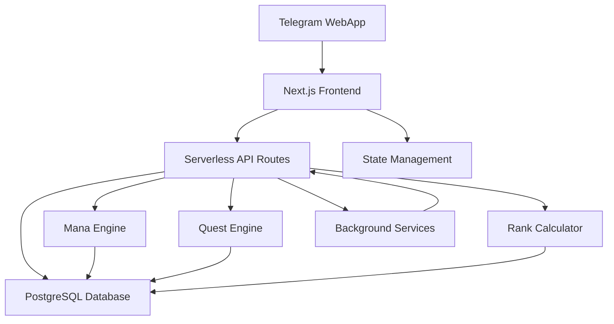

# WSL - Система "Банк Желаний"

Геймифицированное приложение для управления отношениями, созданное как Telegram WebApp, которое помогает парам управлять желаниями, выполнять квесты и развиваться вместе через структурированную систему экономики.

## 🌟 Основные возможности

### Базовые системы
- **Система Желаний**: Трехуровневая экономика желаний (Зеленые/Синие/Красные) с совместными желаниями и одобрением партнера
- **Система Квестов**: Создавайте и назначайте квесты партнеру с наградами и очками опыта
- **Случайные События**: Неожиданные вызовы, которые появляются периодически, чтобы поддерживать интерес в отношениях
- **Система Рангов**: Прогресс через уровни на основе выполненных активностей и полученного опыта
- **Система Маны**: Продвинутое управление валютой с отслеживанием транзакций и мониторингом баланса
- **Панель Администратора**: Комплексные инструменты администрирования для мониторинга системы и управления пользователями

### Ключевые возможности
- 🎮 **Геймифицированный Опыт**: Зарабатывайте очки, повышайте уровень и открывайте достижения
- 💝 **Совместные Желания**: Совместное создание желаний, требующих одобрения партнера
- 📱 **Дизайн Mobile-First**: Оптимизировано для Telegram WebApp
- 🔒 **Безопасная Аутентификация**: Аутентификация пользователей через Telegram
- 📊 **Мониторинг Производительности**: Метрики системы и отслеживание производительности в реальном времени
- 🌐 **Адаптивный Дизайн**: Работает безупречно на всех размерах устройств

## 🛠️ Технический Стек

### Frontend
- **Next.js 14** с App Router
- **React 18** с Server Components
- **TypeScript** для типобезопасности
- **Tailwind CSS** для стилизации
- **Framer Motion** для анимаций

### Backend
- **Next.js API Routes** (Serverless)
- **PostgreSQL** через Vercel Postgres
- **Node.js** среда выполнения

### Внешние интеграции
- **Telegram Bot API** для функциональности WebApp
- **Vercel** для развертывания и хостинга

### Инструменты разработки
- **Vitest** для тестирования
- **ESLint** для линтинга кода
- **TypeScript** для проверки типов

## 🚀 Начало работы

### Предварительные требования
- Node.js 18 или выше
- База данных PostgreSQL
- Токен Telegram Bot

### Установка

1. **Клонирование репозитория**
   ```bash
   git clone <url-репозитория>
   cd WSL
   ```

2. **Установка зависимостей**
   ```bash
   npm install
   ```

3. **Настройка окружения**
   
   Создайте файл `.env.local` в корневой директории:
   ```env
   # База данных
   POSTGRES_URL=строка_подключения_к_postgres
   
   # Telegram
   TELEGRAM_BOT_TOKEN=токен_вашего_telegram_бота
   
   # Развертывание (для продакшена)
   VERCEL_URL=url_развертывания_vercel
   
   # Доступ администратора
   ADMIN_USER_IDS=telegram_user_ids_через_запятую
   ```

4. **Настройка базы данных**
   
   Инициализируйте базу данных с миграциями:
   ```bash
   npm run init-db
   npm run migrate
   npm run migrate:data
   ```

5. **Сервер разработки**
   ```bash
   npm run dev
   ```
   
   Откройте [http://localhost:3000](http://localhost:3000) для просмотра приложения.

### Настройка Telegram Bot

1. Создайте нового бота через [@BotFather](https://t.me/BotFather)
2. Настройте URL WebApp в настройках бота
3. Сконфигурируйте токен бота в переменных окружения

Для подробных инструкций по настройке Telegram см. [TELEGRAM_SETUP.md](TELEGRAM_SETUP.md).

## 📁 Структура проекта

```
WSL/
├── src/
│   ├── app/                    # Страницы Next.js App Router
│   │   ├── admin/             # Страницы панели администратора
│   │   ├── wishes/            # Страницы управления желаниями
│   │   ├── quests/            # Страницы системы квестов
│   │   └── ...
│   ├── components/            # React компоненты
│   │   ├── admin/             # Компоненты для администратора
│   │   ├── wishes/            # Компоненты желаний
│   │   ├── quests/            # Компоненты квестов
│   │   └── ...
│   ├── pages/api/             # API маршруты
│   │   ├── admin/             # API эндпоинты администратора
│   │   ├── wishes/            # API эндпоинты желаний
│   │   ├── quests/            # API эндпоинты квестов
│   │   └── ...
│   ├── lib/                   # Утилиты и бизнес-логика
│   │   ├── engines/           # Основные движки бизнес-логики
│   │   ├── hooks/             # Пользовательские React хуки
│   │   └── ...
│   ├── types/                 # TypeScript определения типов
│   └── test/                  # Тестовые файлы
├── scripts/                   # Скрипты миграции базы данных и утилиты
├── docs/                      # Файлы документации
└── ...
```

## 🎯 Использование

### Для пар

1. **Первоначальная настройка**
   - Оба партнера запускают Telegram бота
   - Завершите процесс связывания
   - Настройте свой первоначальный профиль

2. **Создание желаний**
   - Перейдите на страницу Желаний
   - Выберите тип желания (Зеленое/Синее/Красное)
   - Добавьте описание и категорию
   - Отправьте на одобрение партнеру (если общее)

3. **Управление квестами**
   - Создавайте квесты для партнера
   - Устанавливайте сложность и награды
   - Отслеживайте выполнение и зарабатывайте опыт

4. **Случайные события**
   - Отвечайте на спонтанные события
   - Выполняйте вызовы для бонусных наград
   - Поддерживайте интерес в отношениях

### Для администраторов

Доступ к панели администратора по адресу `/admin` для:
- Мониторинга производительности системы
- Управления учетными записями пользователей
- Просмотра логов транзакций
- Настройки параметров системы

## 🧪 Тестирование

Запуск набора тестов:
```bash
# Запуск всех тестов
npm test

# Режим наблюдения для разработки
npm run test:watch

# Генерация отчета покрытия
npm run test:coverage
```

Тестовые файлы организованы по функциональности в директории `src/test/`.

## 📚 Документация

- [Документация API](API_DOCUMENTATION.md) - Полный справочник API
- [Документация бизнес-логики](BUSINESS_LOGIC_DOCUMENTATION.md) - Обзор системной логики
- [Руководство по развертыванию](DEPLOYMENT_GUIDE.md) - Инструкции по продакшен развертыванию
- [Фоновые сервисы](BACKGROUND_SERVICES.md) - Автоматизированные системные процессы

## 🚀 Развертывание

### Развертывание Vercel

Приложение оптимизировано для развертывания на Vercel:

1. **Подготовка к развертыванию**
   ```bash
   npm run build
   ```

2. **Развертывание на Vercel**
   ```bash
   vercel deploy
   ```

3. **Настройка переменных окружения** в панели управления Vercel

Для подробных инструкций по развертыванию см. [DEPLOYMENT_GUIDE.md](DEPLOYMENT_GUIDE.md).

### Миграции базы данных

Запуск миграций в продакшене:
```bash
npm run migrate
npm run validate-migrations
```

## 🔧 Доступные скрипты

- `npm run dev` - Запуск сервера разработки
- `npm run build` - Сборка для продакшена
- `npm run start` - Запуск продакшен сервера
- `npm run lint` - Запуск ESLint
- `npm run migrate` - Запуск миграций базы данных
- `npm run migrate:data` - Запуск миграций данных
- `npm run init-db` - Инициализация базы данных
- `npm test` - Запуск тестов
- `npm run test:watch` - Запуск тестов в режиме наблюдения

## 🏗️ Архитектура

Приложение WSL следует современной полнофункциональной архитектуре:



### Ключевые шаблоны проектирования
- **Паттерн Repository**: Абстракция доступа к базе данных
- **Паттерн Middleware**: Конвейер обработки запросов
- **Event-Driven Architecture**: Слабосвязанные компоненты системы
- **Serverless Functions**: Масштабируемые API эндпоинты

## 🔧 Основные компоненты системы

### Движок Маны (Mana Engine)
Центральная система экономики, управляющая балансами пользователей, транзакциями и наградами. Реализует паттерн Singleton для обеспечения единой точки управления всеми валютными операциями.

### Движок Квестов (Quest Engine)
Отвечает за управление жизненным циклом квестов от создания до завершения и истечения срока. Обеспечивает бизнес-правила, такие как предотвращение назначения квестов самому себе.

### Калькулятор Рангов (Rank Calculator)
Управляет прогрессом пользователей через очки опыта и пороги рангов, обеспечивая геймифицированный опыт.

### Система Желаний (Wish System)
Трехуровневая система валюты желаний с возможностью создания совместных желаний, требующих одобрения партнера.

### Система Событий (Events System)
Генерирует случайные события для поддержания активности и интереса пользователей в системе.

## 🤝 Вклад в проект

1. Форкните репозиторий
2. Создайте ветку функции (`git checkout -b feature/amazing-feature`)
3. Зафиксируйте изменения (`git commit -m 'Add some amazing feature'`)
4. Отправьте в ветку (`git push origin feature/amazing-feature`)
5. Откройте Pull Request

### Рекомендации по разработке
- Следуйте лучшим практикам TypeScript
- Пишите тесты для новых функций
- Используйте существующий стиль кода
- Обновляйте документацию по мере необходимости

## 🔐 Безопасность

Система включает несколько уровней безопасности:
- Аутентификация через Telegram WebApp
- Контроль доступа администратора
- Валидация запросов и защита от CSRF
- Безопасное управление переменными окружения

## 📈 Производительность

Система оптимизирована для производительности:
- Кэширование данных и запросов
- Виртуализация больших списков
- Lazy loading компонентов
- Оптимизация базы данных с индексами
- Мониторинг производительности в реальном времени

## 📱 Мобильная оптимизация

Приложение полностью оптимизировано для мобильных устройств:
- Адаптивный дизайн с поддержкой различных размеров экрана
- Touch-friendly интерфейс
- Оптимизированные анимации для мобильных устройств
- Быстрая загрузка на медленных соединениях

## 📝 Лицензия

Этот проект является частным и проприетарным.

## 🆘 Поддержка

По вопросам или проблемам:
1. Проверьте существующую документацию
2. Просмотрите руководства по устранению неполадок
3. Откройте issue в репозитории

## 🔄 История версий

- **v0.1.0** - Первый релиз с основной системой желаний
- **Текущая** - Расширена квестами, событиями, рангами и панелью администратора

---

Создано с ❤️ для пар, которые хотят расти вместе через геймифицированное управление отношениями.

## 🎮 Геймификация

Система включает множественные элементы геймификации:

### Система Опыта и Рангов
- Получение очков опыта за выполнение квестов и желаний
- Прогрессия через различные ранги
- Разблокировка новых функций по мере повышения уровня

### Экономическая Система
- Трехуровневая валюта (зеленые, синие, красные желания)
- Система маны для продвинутых операций
- Награды за активность и достижения

### Социальные Элементы
- Совместные желания с партнером
- Система одобрения для важных решений
- Совместное выполнение квестов и событий

## 🔧 Администрирование

### Панель Мониторинга
- Отслеживание активности пользователей
- Мониторинг производительности системы
- Управление экономическими параметрами

### Система Аудита
- Логирование всех критических операций
- Отслеживание изменений в системе
- Безопасность и контроль доступа

### Управление Данными
- Инструменты миграции данных
- Резервное копирование и восстановление
- Валидация целостности данных

Система WSL представляет собой комплексное решение для геймификации отношений с продуманной архитектурой, надежной системой безопасности и удобным пользовательским интерфейсом.